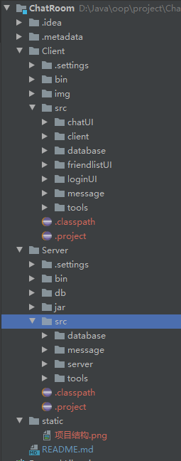

# ChatRoom

项目是一个简单的通过Socket实现的聊天程序，包括服务端和客户端，这里不赘述具体的内容，都挺简单
网上有许多类似的教程。这个项目应该不难看懂。

项目结构：

目前的任务：

1. chatUI包中DialogUI类：聊天界面

2. friendlist包中的三个类：添加好友界面、主界面、好友列表面板
  （这里的FriendListPane其实是主界面，然后里面镶嵌上一个ListPane，分组面板，
   大家可以根据自己的想法做调整，大家把界面做好之后我们再针对设计来改。
   还有就是有的类里面有空的函数体，大家最好实现一下，在其他方法里有调用）
   
3. logininUI中的两个类：登录和注册面板。
（程序入口在注册面板，所以在里面写了main函数。）

4. 描述项⽬的⽂档，内容包含：
    + ⼩组成员的名字、学号、在项⽬中的任务职责
    + 编写项⽬的⽬的（或项⽬想要达成的⽬标）
    + 项⽬运⾏环境，包括硬件种类、JDK 版本、操作系统
    + 类图形式表现的类设计
    + 使⽤到了⽐较⾼级的算法或计数，请吹出来
    + 涉及到的⽂件读写（或⽹络请求），需要指明⽂件（或请求）的解析规则（协议）
    + 使⽤到的第三⽅库，何处使⽤，为何使⽤

5. 使⽤说明书，内容包含：
    + 对于程序各部分使⽤⽅式的引导
    + 使⽤时可能发⽣的错误、错误原因与解决⽅案
    
6. 展示PPT

###暂定分工：

梁茂智：chatUI包+说明书

张勇成：friendlist包+收尾工作

郝盛：logininUI+项目描述文档

沙斌竹：服务端开发+收尾工作+PPT制作

按这样的分工，最后大家贡献量持平。

（PS：这个项目是我从网上扒来改的，我现在上传的server端大部分还是它原来的代码，
因为我自己重写的有点问题一直还没有解决好，为了不影响进度，我就先直接把它原来的代码上传上来，
大家都先按着这个结构参考着干活儿，然后最后我来收尾，项目中的client-tamplate是它原本的client端代码，
大家可以参考。）
    
（编码方式：GBK）

